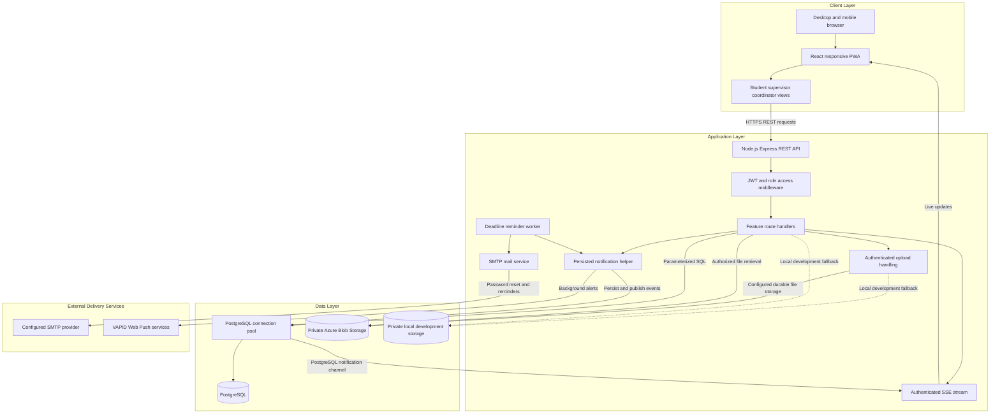
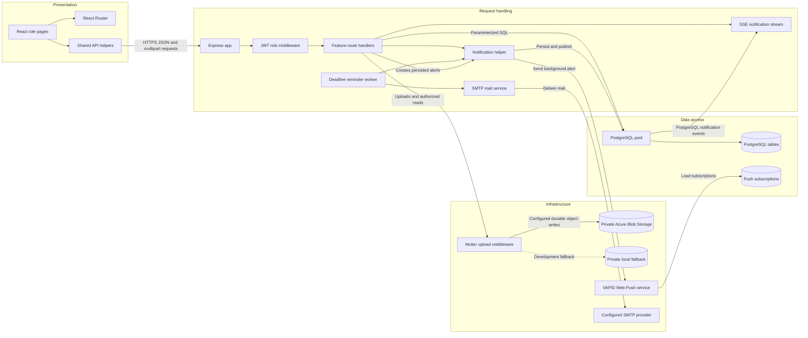

# Architecture Diagram

The prototype is a single responsive React PWA backed by a Node.js/Express API and PostgreSQL. It supports authenticated live notification streams, VAPID browser push, SMTP email, and private Azure Blob Storage; each external provider requires deployment credentials.

## Application Architecture

<!-- mermaid-checked: no \n, no em-dash/en-dash, no {} in labels, subgraphs are id["label"], arrows are -->|"label"|, all subgraphs closed by end, ids unique -->

### Technology Stack Summary

| Layer | Technology | Version | Purpose |
|---|---|---|---|
| Client | React | 19.2.8 | Role-specific responsive user interface |
| Client | React Router | 7.18.4 | Client-side route navigation |
| Client | Vite | 8.3.0 | Frontend development and production build |
| Client | Tailwind CSS | 4.3.3 | Interface styling |
| API | Node.js | Runtime-dependent | JavaScript runtime for the backend |
| API | Express | 5.2.1 | REST endpoints and middleware |
| API | jsonwebtoken | 9.0.3 | Signed bearer tokens for role authentication |
| API | Multer | 2.4.0 | Multipart upload handling |
| API | Azure Storage Blob SDK | Configured | Private durable object storage |
| API | Nodemailer | Configured | SMTP password recovery and deadline email |
| API | web-push | Configured | VAPID browser background notifications |
| Data | node-postgres | 8.23.0 | PostgreSQL connection pool and queries |
| Data | PostgreSQL | Server-dependent | Relational persistence |
| Files | Azure Blob Storage | Configured | Private durable uploads when connection details are set |
| Files | Local filesystem | Runtime-dependent | Private development fallback for uploaded files |

### Data Storage & External Services

The backend uses PostgreSQL for structured records and a private Azure Blob container for attendance images, task attachments, complaint evidence, and student documents when configured. Local development falls back to private local storage. File downloads pass through authenticated, record-scoped API routes. SMTP delivers password recovery and deadline emails; standard VAPID Web Push sends background alerts; PostgreSQL LISTEN/NOTIFY fans out live server-sent events across API processes.

### Key Architectural Decisions

- One React PWA provides role-specific views for students, supervisors, and coordinators on desktop and mobile browsers.
- Express route handlers perform authorization and database access directly; no separate service or repository layer is present in the backend.
- JWT role checks protect APIs, while record-level ownership checks scope access to a user's own or assigned records.
- PostgreSQL persists notification events and reminder state, coordinating authenticated SSE delivery and duplicate-safe deadline reminders.

## Component Relationships

<!-- mermaid-checked: no \n, no em-dash/en-dash, no {} in labels, subgraphs are id["label"], arrows are -->|"label"|, all subgraphs closed by end, ids unique -->

### Component Inventory

| Component | Layer | Type | Responsibility |
|---|---|---|---|
| React role pages | Presentation | Pages and components | Render student, supervisor, and coordinator workflows |
| React Router | Presentation | Router | Maps browser paths to page components |
| Shared API helpers | Presentation | API utility | Adds the configured API URL and role bearer token |
| Express app | Request handling | HTTP application | Configures middleware and API route registration |
| JWT role middleware | Request handling | Authentication middleware | Verifies bearer tokens and restricts allowed roles |
| Feature route handlers | Request handling | REST handlers | Apply input and record-ownership checks, execute feature workflows |
| Notification helper | Request handling | Shared function | Persists notifications and publishes SSE and Web Push events |
| SSE notification stream | Request handling | Authenticated stream | Delivers live role-specific notifications |
| Deadline reminder worker | Request handling | Scheduled worker | Enqueues idempotent reminders 24 hours before and at due time |
| SMTP mail service | Infrastructure | SMTP client | Sends password-reset links and deadline reminder emails |
| PostgreSQL pool | Data access | Connection pool | Executes parameterized SQL against the configured database |
| PostgreSQL tables | Data access | Relational database | Stores accounts, attendance, tasks, complaints, evaluations, and related records |
| Multer upload middleware | Infrastructure | Upload middleware | Validates and parses multipart file uploads |
| Private Azure Blob Storage | Infrastructure | Object storage | Durably stores private files when configured |
| Private local fallback | Infrastructure | Local filesystem | Stores private local development uploads |
| VAPID Web Push service | Infrastructure | Web Push | Delivers background browser alerts to opted-in devices |
| Configured SMTP provider | Infrastructure | Email service | Delivers recovery links and scheduled task emails |
